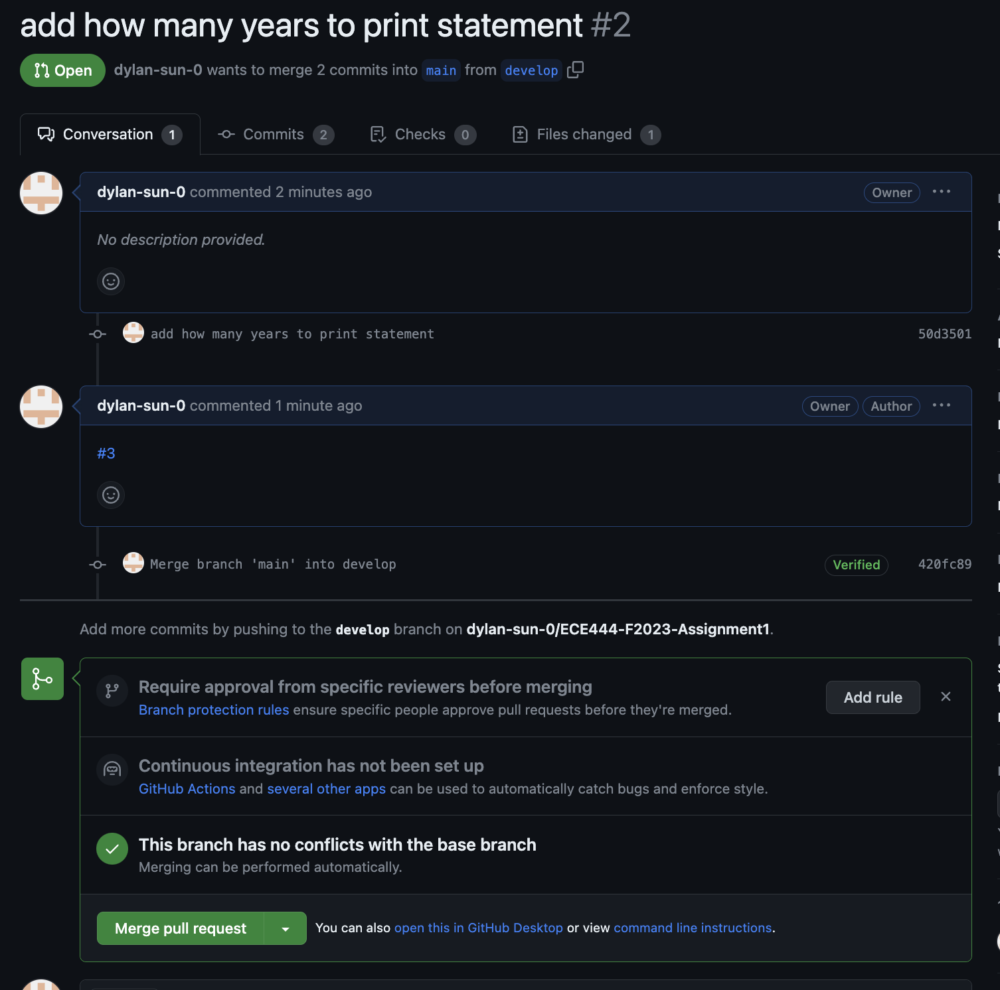
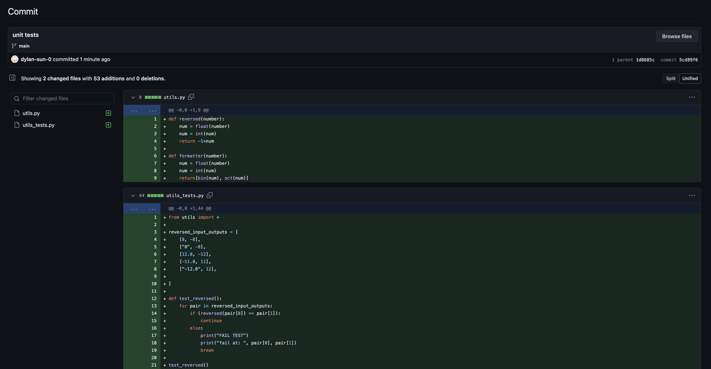
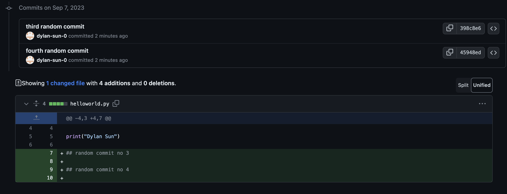
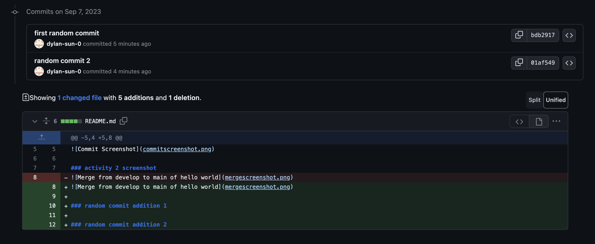
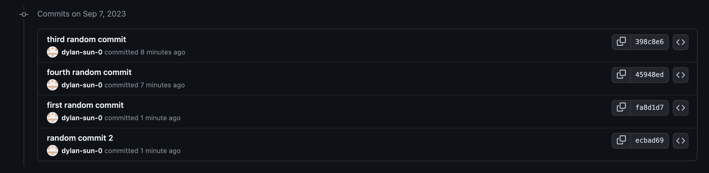

# Dylan Sun

### activity 1 screenshot
commit screenshot 

### activity 2 screenshot 
commit of merge from develop to main of hello world

### activity 3 screenshot
issue is linked to PR with code in comments

sucessful merge of PR after resolving merge conflict

### activity 4 screenshot 
commit of unit tests (could not include all the code in screenshot, check the file for full code)

### activity 5 screenshot
random merge 3 and 4 on develop

random merge 1 and 2 on rebase

commit order after merge was rebased onto develop and pulled
